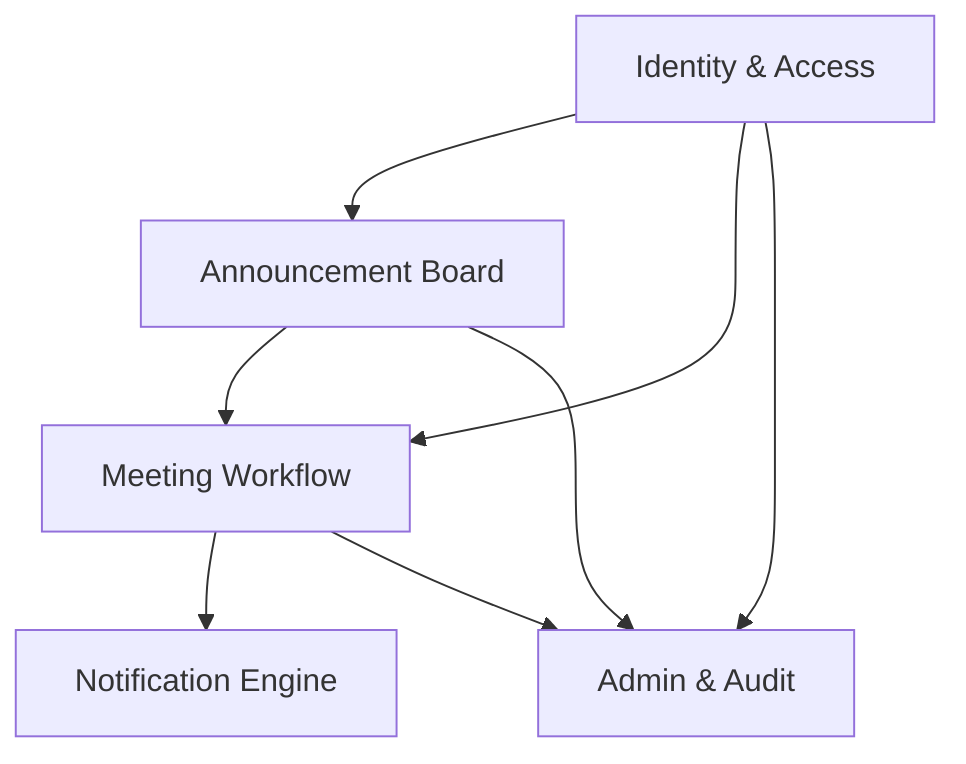

# HEALTH AI Co-Creation Platform — Full System Design

> **Decisions resolved:** Bidirectional time-slot proposals (both parties can propose) · Real-time in-app notifications (SSE) + transactional email

> **Software Architect Analysis** · Based on project brief `co-creation platform project brief-revised.docx`  
> **Current state:** Landing page (auth entry point) built in Next.js  
> **This document covers:** Everything that still needs to be built.

---

## 1. Domain Analysis & Bounded Contexts

The platform has five distinct business domains. Each is a bounded context with its own data ownership and rules.



| Bounded Context | Core Responsibility | Key Aggregates |
|---|---|---|
| **Identity & Access** | Registration, auth, RBAC, GDPR | `User`, `Role`, `Session` |
| **Announcement Board** | Post lifecycle, search, matching | `Announcement`, `Tag`, `Match` |
| **Meeting Workflow** | NDA, time proposals, status | `MeetingRequest`, `TimeSlot` |
| **Notification Engine** | Email + in-app delivery | `Notification`, `NotificationPreference` |
| **Admin & Audit** | Oversight, moderation, logs | `AuditLog`, `AdminAction` |

---

## 2. Architecture Decision Records

### ADR-001: Modular Monolith (Next.js App Router + API Routes)

**Status:** Accepted

**Context:** Small academic team, well-defined but evolving domain boundaries, no independent scaling requirement for this semester.

**Decision:** Build as a **modular Next.js monolith** using App Router. Each bounded context becomes a `src/modules/<context>/` folder with its own routes, components, and server actions. The `/app/api/` layer enforces context boundaries.

**Trade-offs:**
- ✅ One deployment, zero orchestration overhead
- ✅ Shared DB connection pool, no network hops between contexts
- ✅ Easy to extract a service later if scale demands it
- ❌ A bug in one module can affect others (mitigated by strict module boundaries)
- ❌ Can't scale announcement search independently (acceptable at 1000 concurrent users)

---

### ADR-002: PostgreSQL via Prisma ORM

**Status:** Accepted

**Context:** Need relational integrity for RBAC, post lifecycle, meeting state machines. Need audit logs with tamper-resistance. Need GDPR data export.

**Decision:** PostgreSQL with Prisma. Audit logs in an append-only table with DB-level trigger to prevent UPDATE/DELETE.

**Trade-offs:**
- ✅ Strong referential integrity, transaction support
- ✅ Prisma migrations give schema history
- ✅ Row-level security possible for GDPR compliance
- ❌ Full-text search requires `pg_trgm` or a dedicated index (Postgres handles this fine at this scale)

---

### ADR-003: NextAuth.js for Authentication

**Status:** Accepted

**Context:** Must restrict registration to `.edu` emails. Need email verification. Need sessions with timeouts.

**Decision:** NextAuth.js (Auth.js v5) with **Email Provider** (magic link / OTP). Custom `.edu` domain validation middleware. JWT sessions with 30-minute idle timeout.

**Trade-offs:**
- ✅ Battle-tested, integrates natively with Next.js
- ✅ Email-only auth aligns with the "no personal email" constraint
- ❌ Magic links require a transactional email service (Resend or SendGrid — negligible setup)

---

### ADR-004: No File Storage (Enforced at Application Layer)

**Status:** Accepted

**Context:** Brief explicitly forbids document uploads, patient data, file repositories.

**Decision:** No file upload endpoints exist. All post fields are text-only. File upload UI components are not built. This is enforced in server actions (reject multipart requests).

---

### ADR-005: Server-Sent Events (SSE) for Real-Time Notifications

**Status:** Accepted

**Context:** Bidirectional time-slot negotiation requires each party to know when the other has proposed new slots or responded — polling would create a laggy, confusing UX. WebSockets are the gold standard but require stateful server infrastructure not available on Vercel's serverless default.

**Decision:** Use **Server-Sent Events (SSE)** via a Next.js Route Handler streaming response (`/api/notifications/stream`). The client `EventSource` connects on login and stays open. When a notification is written to the DB, the SSE handler pushes a lightweight event `{ type, notificationId }` to the connected user. The client then fetches the full notification from `/api/notifications`. This is a **unidirectional push** (server → client), which is sufficient — client mutations go via normal REST API calls.

**SSE Connection Lifecycle:**
- Open on authenticated page load (layout.tsx)
- Heartbeat ping every 25s to prevent proxy timeouts
- Auto-reconnect via `EventSource` browser API
- Close on logout

**Trade-offs:**
- ✅ No stateful WebSocket server required; works on Vercel serverless with streaming
- ✅ Automatic browser reconnection built in
- ✅ Simpler than WebSockets for unidirectional push use case
- ❌ Cannot push server → client for bilateral real-time edits (not needed here)
- ❌ Each SSE stream holds a connection open — acceptable at ≤1000 concurrent users, monitor at scale

---

## 3. Technology Stack

| Layer | Technology | Rationale |
|---|---|---|
| Framework | Next.js 14 (App Router) | Already in use |
| Styling | Vanilla CSS + CSS Modules | Already in use, per DESIGN.md |
| Database | PostgreSQL (via Neon/Railway) | Relational, GDPR-friendly |
| ORM | Prisma | Type-safe, migration history |
| Auth | Auth.js v5 (NextAuth) | Native Next.js, email provider |
| Email | Resend | Developer-friendly, transactional |
| Deployment | Vercel | Native Next.js hosting |
| Monitoring | Vercel Analytics + Sentry | Error tracking + performance |

---

## 4. Complete Data Model

```prisma
// Core identity
model User {
  id            String    @id @default(cuid())
  email         String    @unique
  emailVerified DateTime?
  role          Role      @default(ENGINEER)
  name          String?
  institution   String?   // e.g., "MIT"
  city          String?
  country       String?
  bio           String?   @db.Text
  expertise     String[]  // tags array
  isActive      Boolean   @default(true)
  isSuspended   Boolean   @default(false)
  createdAt     DateTime  @default(now())
  updatedAt     DateTime  @updatedAt
  deletedAt     DateTime? // soft delete for GDPR

  announcements    Announcement[]
  sentRequests     MeetingRequest[] @relation("Requester")
  receivedRequests MeetingRequest[] @relation("Recipient")
  notifications    Notification[]
  auditLogs        AuditLog[]
}

enum Role {
  ENGINEER
  HEALTHCARE_PROFESSIONAL
  ADMIN
}

// Announcement (the core entity)
model Announcement {
  id                String             @id @default(cuid())
  authorId          String
  author            User               @relation(fields: [authorId], references: [id])

  title             String
  domain            String             // "cardiology imaging", "orthopedics", etc.
  explanation       String             @db.Text
  expertiseNeeded   String             // what the OTHER role provides
  projectStage      ProjectStage
  commitmentLevel   CommitmentLevel
  collaborationType CollaborationType? // engineers only
  confidentiality   Confidentiality
  publicPitch       String?            @db.Text // shown publicly
  city              String
  country           String

  status    AnnouncementStatus @default(DRAFT)
  expiresAt DateTime?
  autoClose Boolean            @default(false)

  createdAt DateTime  @default(now())
  updatedAt DateTime  @updatedAt
  closedAt  DateTime?

  meetingRequests MeetingRequest[]
  tags            AnnouncementTag[]
}

enum AnnouncementStatus {
  DRAFT
  ACTIVE
  MEETING_SCHEDULED
  PARTNER_FOUND
  EXPIRED
  ARCHIVED
}

enum ProjectStage {
  IDEA
  CONCEPT_VALIDATION
  PROTOTYPE_DEVELOPED
  PILOT_TESTING
  PRE_DEPLOYMENT
}

enum CommitmentLevel {
  LOW    // advisory, occasional
  MEDIUM // part-time research
  HIGH   // co-founder level
}

enum CollaborationType {
  ADVISOR
  CO_FOUNDER
  RESEARCH_PARTNER
}

enum Confidentiality {
  PUBLIC_PITCH       // full details visible
  DETAILS_IN_MEETING // only pitch visible, rest disclosed at meeting
}

// Meeting Request workflow
model MeetingRequest {
  id             String               @id @default(cuid())
  announcementId String
  announcement   Announcement         @relation(fields: [announcementId], references: [id])
  requesterId    String
  requester      User                 @relation("Requester", fields: [requesterId], references: [id])
  recipientId    String
  recipient      User                 @relation("Recipient", fields: [recipientId], references: [id])

  message       String               @db.Text // initial interest message
  ndaAccepted   Boolean              @default(false)
  ndaAcceptedAt DateTime?

  status        MeetingRequestStatus @default(PENDING)
  proposedSlots TimeSlot[]
  agreedSlot    DateTime?

  createdAt DateTime @default(now())
  updatedAt DateTime @updatedAt
}

enum MeetingRequestStatus {
  PENDING          // sent, awaiting acknowledgment
  SLOTS_PROPOSED   // one party has proposed slots (either side)
  COUNTER_PROPOSED // other party rejected all and proposed new slots
  CONFIRMED        // a slot was accepted by one party
  DECLINED
  CANCELLED
  COMPLETED
}

model TimeSlot {
  id               String         @id @default(cuid())
  meetingRequestId String
  meetingRequest   MeetingRequest @relation(fields: [meetingRequestId], references: [id])
  proposedBy       String         // userId — either party can propose
  startTime        DateTime
  endTime          DateTime
  status           SlotStatus     @default(PENDING)
  round            Int            @default(1) // negotiation round number
}

enum SlotStatus {
  PENDING  // awaiting selection
  SELECTED // this slot was chosen — meeting confirmed
  REJECTED // explicitly passed over
  EXPIRED  // past datetime, never confirmed
}

// Notifications
model Notification {
  id        String           @id @default(cuid())
  userId    String
  user      User             @relation(fields: [userId], references: [id])
  type      NotificationType
  title     String
  body      String
  linkUrl   String?
  isRead    Boolean          @default(false)
  createdAt DateTime         @default(now())
}

enum NotificationType {
  NEW_INTEREST           // someone expressed interest in your post
  MEETING_REQUEST        // meeting request received
  SLOTS_PROPOSED         // first set of time slots proposed (either party)
  COUNTER_SLOTS_PROPOSED // other party proposed new slots in a new round
  SLOT_SELECTED          // the other party selected a slot — meeting confirmed
  MEETING_DECLINED       // your request was declined
  MEETING_CANCELLED      // meeting was cancelled
  PARTNER_FOUND          // announcement owner marked partner found
  ACCOUNT_SUSPENDED      // admin action
  SYSTEM                 // broadcast / maintenance messages
}

// Audit Log (append-only, tamper-resistant)
model AuditLog {
  id           String      @id @default(cuid())
  userId       String?
  user         User?       @relation(fields: [userId], references: [id])
  role         Role?
  actionType   AuditAction
  targetEntity String?     // e.g., "Announcement:clx123"
  result       String      // "success" | "failure"
  ipAddress    String?     // nullable, GDPR-compliant
  metadata     Json?       // extra context, no PII
  createdAt    DateTime    @default(now())
  // No updatedAt — append-only
}

enum AuditAction {
  LOGIN
  LOGOUT
  LOGIN_FAILED
  REGISTER
  EMAIL_VERIFIED
  POST_CREATED
  POST_EDITED
  POST_CLOSED
  POST_EXPIRED
  POST_ARCHIVED
  POST_REMOVED_BY_ADMIN
  MEETING_REQUEST_SENT
  MEETING_REQUEST_ACKNOWLEDGED
  MEETING_REQUEST_CONFIRMED
  MEETING_REQUEST_DECLINED
  MEETING_REQUEST_CANCELLED
  PARTNER_FOUND_MARKED
  ADMIN_USER_SUSPENDED
  ADMIN_USER_REACTIVATED
  DATA_EXPORT_REQUESTED
  ACCOUNT_DELETED
}
```

---

## 5. Complete Page Inventory

### 5.1 Public Pages (Unauthenticated)

| Route | Page Name | Description |
|---|---|---|
| `/` | **Landing / Auth Entry** | ✅ **Already built.** Split-screen hero + email auth |
| `/auth/verify` | **Email Verification** | "Check your inbox" confirmation screen with resend option |
| `/auth/complete-profile` | **Onboarding** | New user fills name, institution, role, city, country, expertise tags |
| `/privacy` | **Privacy Policy** | GDPR-compliant privacy policy page |
| `/about` | **About the Platform** | Platform explainer for first-time visitors |

---

### 5.2 Core Authenticated Pages

#### 🏠 Dashboard (`/dashboard`)
**The home base after login.**

Layout: `surface-container-low` background with the signature grid. Split into:
- **Left sidebar:** Navigation links, user role badge, notification bell
- **Main area:** Feed of announcements (filtered by relevance to your role/city)
- **Right panel (collapsible):** "Your Activity" — your posts, pending meeting requests

Key components:
- `AnnouncementFeed` — paginated list of active announcements with filter chips
- `MatchHighlight` badge — "3 posts near you in Berlin"
- `QuickActions` bar — "Post Announcement" CTA, "View My Requests"

---

#### 📋 Announcement Board (`/board`)
**Browse all active announcements with advanced filtering.**

Components:
- `FilterBar` — dropdowns for: Domain, Required Expertise, City, Country, Project Stage, Status
- `AnnouncementCard` — shows: Title, Role (Engineer/Doctor), Domain, City, Stage badge, Commitment badge, Match score
- `SortBy` — Newest, Most Relevant (city match first), Closing Soon
- `MapView` toggle (optional later stage) — geographical clustering

State: URL-driven filters (`/board?domain=cardiology&city=Berlin`) for shareability.

---

#### 📌 Announcement Detail (`/board/[id]`)
**Full view of a single announcement.**

Sections:
1. **Header:** Title, author role, city, domain, status badge
2. **Post Body:** Public pitch / confidentiality notice
3. **Metadata strip:** Project stage, commitment level, collaboration type, expiry
4. **Author Card:** Institution (NOT full profile — privacy by default)
5. **Match Explanation:** "You match on: Cardiology, Berlin"
6. **CTA:** `Express Interest` button → opens `InterestModal`

`InterestModal`:
- Short message textarea (required, max 300 chars)
- NDA accept checkbox with tooltip ("Why do I need to accept this?")
- Submit button

---

#### ✍️ Create Announcement (`/announcements/new`)
**Multi-step form (≤3 steps per NFR requirement).**

**Step 1 — Basics:**
- Title (required)
- Role context (auto-filled from user role)
- Domain (searchable dropdown with common health-tech domains)
- Short explanation (textarea, 500 char max)

**Step 2 — Details:**
- Expertise needed (tag selector)
- Project Stage (pill selector)
- Commitment Level (pill selector)
- Collaboration Type (engineer only)
- Confidentiality Level (radio with explanation tooltips)
- Public pitch (if `PUBLIC_PITCH` selected)

**Step 3 — Location & Settings:**
- City, Country (pre-filled from profile, editable)
- Expiry date (optional date picker)
- Auto-close toggle
- Preview → Submit

Progress indicator: `Step 1 of 3` with back navigation.

---

#### ✏️ Edit Announcement (`/announcements/[id]/edit`)
**Same form as Create, pre-populated. Only author can access.**

Status constraint: Cannot edit an announcement in `PARTNER_FOUND` or `EXPIRED` state.

---

#### 👤 My Announcements (`/my-announcements`)
**Author's view of their own posts.**

Tabs: `Active` | `Draft` | `Closed` | `Expired`

Each card shows:
- Post title, status badge
- Interest count ("4 people expressed interest")
- Meeting request count
- Quick actions: Edit, Close, Archive, Mark Partner Found

---

#### 💬 My Requests (`/my-requests`)
**All meeting requests — sent AND received.**

Two tabs:
1. **Received** (for announcement owners) — list of inbound interest messages
   - Expand to read message + NDA status → "Propose Time Slots" CTA
2. **Sent** (for requesters) — list of requests you've made
   - Status badge per request: Pending / Slots Proposed / Counter-Proposed / Confirmed / Declined

**Request Detail View (`/my-requests/[id]`):**
- Full conversation-style layout (timeline of actions)
- Current round's time slots displayed as selectable cards
- **Both parties see:** "Propose new slots" CTA (creates a new round if current slots are rejected)
- **Accept / Decline / Counter-Propose** action buttons
- Visual negotiation rounds: "Round 1 — You proposed" → "Round 2 — They proposed"
- Real-time update: when the other party acts, the page updates via SSE without refresh
- Once confirmed: greyed-out past rounds, highlighted confirmed slot with calendar link placeholder

---

#### 👤 Profile (`/profile`)
**User's own editable profile.**

Sections:
- Avatar (initials-based, no photo upload to minimize PII)
- Name, Institution, City, Country
- Role (read-only after registration)
- Bio (optional, 300 chars)
- Expertise tags (multi-select)
- Notification preferences
- **GDPR Actions:** "Export My Data" | "Delete My Account"

---

#### 🔔 Notifications (`/notifications`)
**Full notification history.**

- Grouped by date
- Mark all as read
- Each notification is a link to the relevant announcement/request
- Read vs unread visual distinction

---

### 5.3 Admin Pages (`/admin/*`)

All admin pages are guarded by RBAC middleware — `ADMIN` role only.

#### 📊 Admin Dashboard (`/admin`)
KPI tiles:
- Total registered users (by role)
- Active announcements
- Meetings requested / confirmed this week
- Closed (Partner Found) rate
- Suspended users count

Charts (simple, lightweight):
- Announcement creation over time (7d / 30d)
- Domain distribution pie

---

#### 👥 Admin — User Management (`/admin/users`)
- Table: Name, Email, Role, Institution, City, Status, Joined date
- Filters: Role, Status (Active/Suspended/Deleted), Country
- Actions per row: View Profile, Suspend, Reactivate, Delete

**User Detail (`/admin/users/[id]`):**
- Full profile info
- Activity metrics: posts created, requests sent/received
- Audit log for this user
- Suspend / reactivate with mandatory reason (logged)

---

#### 📋 Admin — Post Management (`/admin/posts`)
- Table: Title, Author, Domain, City, Status, Created, Expires
- Filters: City, Domain, Status
- Actions: View, Remove (with mandatory reason), View lifecycle history

**Post Lifecycle View:** Visual timeline of status transitions with timestamps.

---

#### 📜 Admin — Audit Logs (`/admin/logs`)
- Table: Timestamp, User, Role, Action, Target, Result, IP
- Filters: User ID, Date range, Action type, Role
- Export to CSV button
- Anomaly highlight: Failed logins > 5 in 10 min shown in orange

---

#### ⚙️ Admin — Platform Settings (`/admin/settings`)
- Allowed email domains (currently: all `.edu`)
- Session timeout duration
- Announcement expiry defaults
- Maintenance mode toggle

---

## 6. API Route Design

All routes under `/app/api/` follow REST conventions. Protected by session middleware.

```
AUTH
  POST /api/auth/[...nextauth]   — NextAuth handler
  POST /api/auth/verify-email    — Token verification

USERS
  GET    /api/users/me           — Current user profile
  PATCH  /api/users/me           — Update profile
  DELETE /api/users/me           — GDPR: delete account (soft delete)
  GET    /api/users/me/export    — GDPR: JSON data export

ANNOUNCEMENTS
  GET    /api/announcements           — List (filters via query params)
  POST   /api/announcements           — Create
  GET    /api/announcements/:id       — Single post
  PATCH  /api/announcements/:id       — Edit (author only)
  DELETE /api/announcements/:id       — Archive (author only)
  POST   /api/announcements/:id/close — Mark Partner Found

MEETING REQUESTS
  POST   /api/meetings                          — Send interest + NDA accept
  GET    /api/meetings                          — My requests (sent + received)
  GET    /api/meetings/:id                      — Detail (includes all slot rounds)
  PATCH  /api/meetings/:id/decline              — Decline request
  PATCH  /api/meetings/:id/cancel               — Cancel request
  POST   /api/meetings/:id/slots                — Propose slots (new round, either party)
  POST   /api/meetings/:id/slots/:slotId/select — Select a slot → CONFIRMED
  POST   /api/meetings/:id/complete             — Mark meeting as completed

NOTIFICATIONS
  GET    /api/notifications          — List (unread first)
  PATCH  /api/notifications/read-all — Mark all read
  PATCH  /api/notifications/:id/read — Mark one read
  GET    /api/notifications/stream   — SSE stream (long-lived, authenticated)
                                       Events: { type: "NOTIFICATION", id: string }
                                       Heartbeat: { type: "PING" } every 25s

ADMIN (require ADMIN role)
  GET    /api/admin/users        — All users
  PATCH  /api/admin/users/:id    — Suspend/reactivate
  DELETE /api/admin/users/:id    — Hard delete
  GET    /api/admin/posts        — All posts
  DELETE /api/admin/posts/:id    — Remove post
  GET    /api/admin/logs         — Audit logs (filterable)
  GET    /api/admin/logs/export  — CSV export
  GET    /api/admin/stats        — Platform KPIs
```

---

## 7. Security & GDPR Implementation

### Security Controls

| Control | Implementation |
|---|---|
| HTTPS | Enforced by Vercel (HSTS) |
| Password storage | N/A — magic link auth only |
| Session management | NextAuth JWT, 30min idle timeout |
| Rate limiting | `next-rate-limit` or Vercel Edge middleware — 10 req/min on auth endpoints |
| Anti-bot | Honeypot field on registration + email verification gate |
| RBAC | Middleware checks `session.user.role` on every `/admin` and `/api/admin` route |
| Input validation | Zod schemas on all API routes and Server Actions |
| Audit trail | Every mutating action writes to `AuditLog` in the same DB transaction |
| SQL injection | Prisma parameterized queries (no raw SQL) |
| XSS | React escaping by default + CSP headers via `next.config.js` |

### GDPR Controls

| Right | Implementation |
|---|---|
| Right to access | `GET /api/users/me/export` returns full JSON of user data |
| Right to erasure | Soft delete: `user.deletedAt = now()`, PII fields nulled, posts/requests preserved with anonymized author |
| Data minimization | No file storage, no IP logging by default (opt-in per GDPR) |
| Consent | NDA checkbox on meeting request, privacy policy linked on registration |
| Data retention | Cron job: hard-delete soft-deleted users after 30 days; purge audit logs > 24 months |

---

## 8. State Machines

### Announcement Lifecycle

```
DRAFT → ACTIVE → MEETING_SCHEDULED → PARTNER_FOUND (terminal)
               ↓                   ↑
             EXPIRED (terminal)    |
               ↓                  |
             ARCHIVED (terminal) ACTIVE (can reopen from MEETING_SCHEDULED if meeting fails)
```

### Meeting Request Lifecycle (Bidirectional Slot Negotiation)

```
PENDING
  │
  ├─[recipient OR requester proposes slots]──► SLOTS_PROPOSED
  │                                                │
  │                              ┌─────────────────┤
  │                              │ [other party     │
  │                              │  counter-proposes│
  │                              ▼  new round]      │
  │                         COUNTER_PROPOSED        │
  │                              │                  │
  │                              │ [a slot selected │
  │                              └────────────────► ▼
  │                                             CONFIRMED → COMPLETED (terminal)
  │
  ├─[either party declines]──► DECLINED (terminal)
  └─[either party cancels] ──► CANCELLED (terminal)
```

**Round model:** Each call to `POST /api/meetings/:id/slots` creates a new round of `TimeSlot` records. Previous round slots are marked `EXPIRED`. Either party can propose at any point when status is `SLOTS_PROPOSED` or `COUNTER_PROPOSED`. Selecting any slot from any round transitions to `CONFIRMED` and locks the request.

---

## 9. Component Library (Shared)

Extend the existing design system from `DESIGN.md` with these new components:

| Component | Description |
|---|---|
| `StatusBadge` | Colored pill for announcement/request statuses |
| `RoleBadge` | "Engineer" / "Healthcare Professional" indicator |
| `DomainTag` | Searchable domain tag (e.g., "Cardiology") |
| `StageIndicator` | 5-step progress bar for project stage |
| `TimeSlotPicker` | Multi-slot time selector for meeting proposals (both parties reuse this) |
| `SlotRoundHistory` | Collapsible previous rounds showing expired/rejected slots |
| `AnnouncementCard` | Full post card with match explanation |
| `NotificationBell` | Icon with unread badge count |
| `AuditTable` | Filterable data table for admin log view |
| `ConfirmModal` | Generic confirmation dialog with reason input |
| `GDPRBanner` | Cookie/consent notice (one-time) |
| `NDATooltip` | Contextual explanation of NDA requirement |
| `EmptyState` | Illustrated empty states per context |
| `StepForm` | Multi-step form wrapper with progress indicator |
| `MatchScore` | Visual explanation of why a post was matched |

---

## 10. Phased Implementation Roadmap

### Phase 1 — Core Identity & Foundation (Week 1–2)
- [ ] Prisma schema setup + migrations
- [ ] PostgreSQL database provisioned (Neon)
- [ ] Auth.js v5 integration with email magic link
- [ ] `.edu` email validation middleware
- [ ] Email verification flow (`/auth/verify`)
- [ ] Onboarding profile completion (`/auth/complete-profile`)
- [ ] Session management (timeout, RBAC middleware)
- [ ] Layout shell: sidebar nav, notification bell, user avatar

### Phase 2 — Announcement Board (Week 2–3)
- [ ] Create Announcement form (3-step wizard)
- [ ] Announcement list API + filtering
- [ ] Announcement Board page (`/board`) with FilterBar
- [ ] Announcement Detail page (`/board/[id]`)
- [ ] Edit Announcement page
- [ ] My Announcements page (`/my-announcements`)
- [ ] Announcement lifecycle state machine (auto-expiry cron)

### Phase 3 — Meeting Workflow (Week 3–4)
- [ ] Express Interest modal + NDA acceptance
- [ ] Meeting request API: send, propose slots (round-based), select slot, decline, cancel, complete
- [ ] `TimeSlotPicker` component (reused by both parties)
- [ ] `SlotRoundHistory` component (collapsible past rounds)
- [ ] My Requests page (`/my-requests`) — sent + received tabs
- [ ] Request detail with bidirectional timeline layout
- [ ] "Counter-propose" round UX (propose new slots when current ones don't work)
- [ ] Meeting state machine enforcement in API (prevent invalid transitions)
- [ ] Mark Partner Found action + announcement status close

### Phase 4 — Notifications & Profile (Week 4)
- [ ] Notification model + write helper (`createNotification(userId, type, payload)`)
- [ ] SSE stream endpoint (`/api/notifications/stream`) with heartbeat
- [ ] SSE client hook (`useNotificationStream`) in layout for all authenticated pages
- [ ] Real-time notification toast (auto-dismiss, links to relevant page)
- [ ] Transactional email via Resend (interest received, slot proposed, meeting confirmed, etc.)
- [ ] Notifications page (`/notifications`) — full history
- [ ] Notification bell with live unread badge
- [ ] My Requests page auto-refreshes slot state on SSE event (no full-page reload)
- [ ] Profile page with edit + GDPR actions
- [ ] Data export endpoint
- [ ] Account deletion (soft delete + PII erasure)

### Phase 5 — Admin Dashboard (Week 5)
- [ ] Admin middleware guard (RBAC)
- [ ] Admin Dashboard KPI tiles + charts
- [ ] User Management table + suspend/reactivate
- [ ] Post Management table + remove action
- [ ] Audit Log dashboard + CSV export
- [ ] Platform Settings page

### Phase 6 — Hardening & Polish (Week 6)
- [ ] Rate limiting on auth + API routes
- [ ] Zod validation on all Server Actions
- [ ] WCAG 2.1 audit + fixes
- [ ] Mobile responsive pass
- [ ] Performance audit (Lighthouse > 90)
- [ ] Error handling + Sentry integration
- [ ] GDPR retention cron jobs
- [ ] End-to-end testing of both user flows (Engineer + Doctor)
- [ ] Security review (OWASP Top 10 checklist)

---

## 11. Resolved Decisions

| Decision | Resolution |
|---|---|
| Time slot flow | **Bidirectional** — either party can propose/counter-propose in rounds |
| Notification delivery | **SSE (real-time in-app) + transactional email** via Resend |

## 12. Notes & Implementation Reminders

> **Geographic matching:** Simple `city === user.city` string match is sufficient for semester scope. No lat/lng radius needed.

> **Admin seeding:** Pre-seed one admin account in the database (`prisma/seed.ts`). Document the seed email in `SETUP.md`.

> **SSE on Vercel:** The SSE stream route must use `export const runtime = 'edge'` to avoid the 30s serverless timeout. Edge Runtime has no Prisma access — the SSE handler only pushes a `{ notificationId }` event; the client fetches full data via `/api/notifications`.
